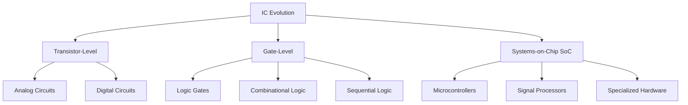
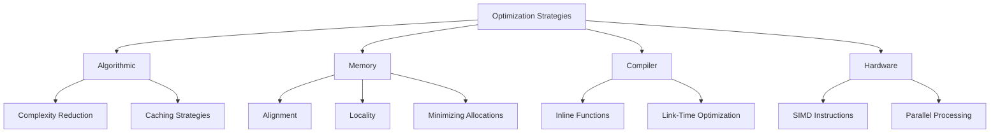
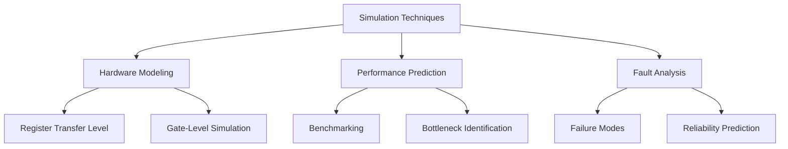

# Advanced Topics in Low-Level Programming and IC Design

## Integrated Circuits (ICs) Overview



## Design and Fabrication Process


## Signal Processing for Medical Diagnostics

```c
// ECG Signal Processing Example
typedef struct {
    float* raw_data;
    float* filtered_data;
    size_t sample_count;
    float sampling_rate;
} ECGSignal;

float* bandpass_filter(ECGSignal* signal, float low_freq, float high_freq) {
    // Implement bandpass filtering
    float* filtered = malloc(signal->sample_count * sizeof(float));
    if (!filtered) return NULL;

    // Placeholder for actual filtering algorithm
    for (size_t i = 0; i < signal->sample_count; i++) {
        // Simplified filtering logic
        filtered[i] = signal->raw_data[i];
    }

    return filtered;
}

float calculate_heart_rate(ECGSignal* signal) {
    // Detect R-peaks and calculate heart rate
    float heart_rate = 0.0f;
    // Placeholder peak detection algorithm
    return heart_rate;
}
```

## Power Management Techniques

```c
// Power State Management
typedef enum {
    POWER_FULL,
    POWER_LOW,
    POWER_SLEEP,
    POWER_HIBERNATE
} PowerState;

typedef struct {
    PowerState current_state;
    float battery_level;
    void (*state_transition_handler)(PowerState);
} PowerManager;

void optimize_power_consumption(PowerManager* pm) {
    if (pm->battery_level < 0.2f) {
        // Enter low power mode
        pm->current_state = POWER_LOW;
        if (pm->state_transition_handler) {
            pm->state_transition_handler(POWER_LOW);
        }
    } else if (pm->battery_level < 0.05f) {
        // Enter hibernate mode
        pm->current_state = POWER_HIBERNATE;
        if (pm->state_transition_handler) {
            pm->state_transition_handler(POWER_HIBERNATE);
        }
    }
}
```

## Performance Optimization Techniques



## Advanced Memory Optimization

```c
// Memory Pool with Optimization
typedef struct {
    void* memory_pool;
    size_t pool_size;
    size_t block_size;
    uint8_t* allocation_map;
} OptimizedMemoryAllocator;

void* optimized_alloc(OptimizedMemoryAllocator* allocator, size_t size) {
    // Find first free block
    for (size_t i = 0; i < allocator->pool_size / allocator->block_size; i++) {
        if (allocator->allocation_map[i] == 0) {
            allocator->allocation_map[i] = 1;
            return (char*)allocator->memory_pool + (i * allocator->block_size);
        }
    }
    return NULL;
}

void optimized_free(OptimizedMemoryAllocator* allocator, void* ptr) {
    size_t offset = (char*)ptr - (char*)allocator->memory_pool;
    size_t block_index = offset / allocator->block_size;
    allocator->allocation_map[block_index] = 0;
}
```

## Simulation and Modeling



## Interactive Design Exercises

1. Design a Simple Microcontroller
2. Implement a Custom Memory Allocator
3. Create a Signal Processing Pipeline
4. Develop a Power Management System
5. Build a Hardware Simulation Framework

## Best Practices

1. Profile before optimizing
2. Understand hardware limitations
3. Use appropriate data structures
4. Minimize memory allocations
5. Leverage compiler optimizations
6. Consider cache behavior
7. Use SIMD when possible
8. Design for scalability
9. Document optimization decisions
10. Continuously measure performance

## Emerging Technologies

1. Neuromorphic Computing
2. Quantum Computing Interfaces
3. AI Hardware Acceleration
4. Edge Computing Architectures
5. Bio-inspired Computing Models

## Interdisciplinary Insights

- Electronics and Medical Technology
- Software and Hardware Co-design
- Embedded Systems Engineering
- Biomedical Signal Processing
- Sustainable Computing
