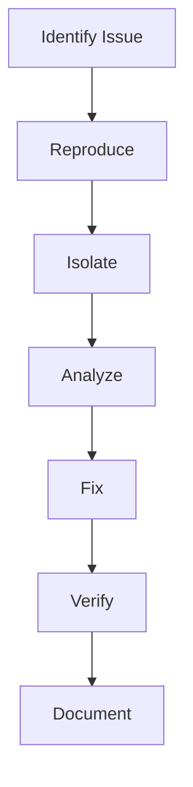

# Advanced Debugging Strategies

## Debugging Workflow


## Debugging Tools
```c
// Example: Using GDB for debugging
#include <stdio.h>

int main() {
    int x = 5;
    int y = 0;
    int z = x / y;  // Division by zero
    printf("Result: %d\n", z);
    return 0;
}

// GDB Commands:
// gcc -g -o debug_example debug_example.c
// gdb ./debug_example
// (gdb) break main
// (gdb) run
// (gdb) print x
// (gdb) print y
// (gdb) step
// (gdb) backtrace
```

## Best Practices
1. Use systematic debugging approach
2. Leverage debugging tools effectively
3. Write test cases for bugs
4. Document debugging process
5. Use version control for tracking
6. Implement logging strategically
7. Validate fixes thoroughly
8. Learn from debugging experiences 