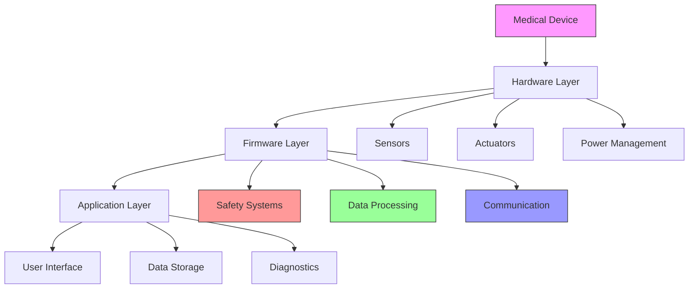
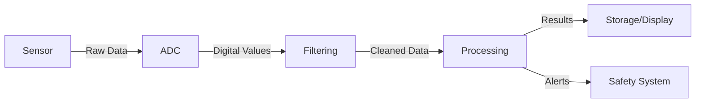
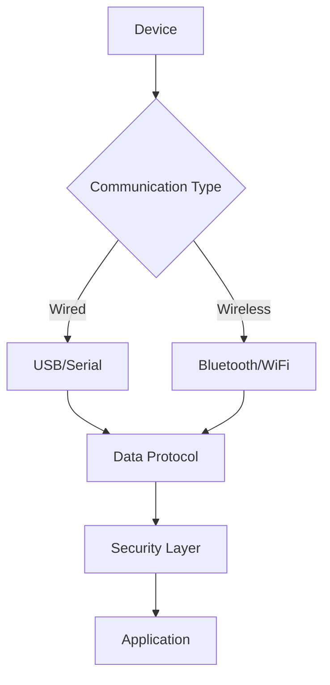
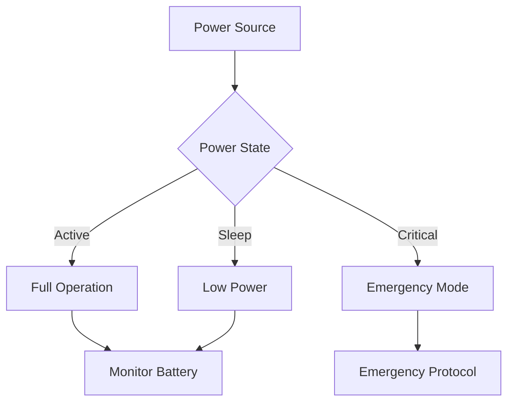

# Medical Device Integration

## System Architecture Overview



## Safety-Critical Programming

```c
// Watchdog timer implementation
typedef struct {
    volatile uint32_t control;
    volatile uint32_t timeout;
    volatile uint32_t reset;
    volatile uint32_t status;
} WatchdogTimer;

void init_watchdog(uint32_t timeout_ms) {
    WatchdogTimer* wdt = (WatchdogTimer*)WDT_BASE_ADDRESS;

    // Configure timeout
    wdt->timeout = (CLOCK_FREQUENCY / 1000) * timeout_ms;

    // Enable with reset capability
    wdt->control = WDT_ENABLE | WDT_RESET_ENABLE;
}

void pet_watchdog(void) {
    WatchdogTimer* wdt = (WatchdogTimer*)WDT_BASE_ADDRESS;
    wdt->reset = WDT_RESET_KEY;
}
```

## Sensor Data Processing



```c
// Signal processing example
typedef struct {
    float* buffer;
    size_t size;
    size_t index;
} CircularBuffer;

float moving_average_filter(CircularBuffer* buf, float new_sample) {
    // Add new sample
    buf->buffer[buf->index] = new_sample;
    buf->index = (buf->index + 1) % buf->size;

    // Calculate average
    float sum = 0.0f;
    for (size_t i = 0; i < buf->size; i++) {
        sum += buf->buffer[i];
    }
    return sum / buf->size;
}
```

## Medical Device Communication



```c
// Secure communication example
typedef struct {
    uint8_t* encryption_key;
    uint8_t* iv;
    size_t key_size;
} SecurityContext;

bool send_secure_data(SecurityContext* ctx, const uint8_t* data, size_t len) {
    // Encrypt data
    uint8_t* encrypted = malloc(len + ENCRYPTION_OVERHEAD);
    if (!encrypted) return false;

    bool success = encrypt_data(ctx, data, len, encrypted);
    if (!success) {
        free(encrypted);
        return false;
    }

    // Send encrypted data
    success = send_data(encrypted, len + ENCRYPTION_OVERHEAD);
    free(encrypted);
    return success;
}
```

## Power Management



## Regulatory Compliance

### FDA Requirements

1. Safety Controls
2. Risk Management
3. Documentation
4. Validation Testing
5. Cybersecurity

### Safety Features Implementation

```c
// Safety check example
typedef struct {
    float min_value;
    float max_value;
    float critical_min;
    float critical_max;
    void (*alert_handler)(const char* msg);
    void (*critical_handler)(const char* msg);
} SafetyCheck;

bool check_value(SafetyCheck* check, float value) {
    if (value < check->critical_min || value > check->critical_max) {
        check->critical_handler("Critical value exceeded!");
        enter_safe_state();
        return false;
    }

    if (value < check->min_value || value > check->max_value) {
        check->alert_handler("Warning: Value out of normal range");
    }

    return true;
}
```

## Testing and Validation

1. Unit Testing
2. Integration Testing
3. System Testing
4. Safety Testing
5. EMC Testing
6. Environmental Testing

## Documentation Requirements

1. Design Documentation
2. Risk Analysis
3. Test Reports
4. User Manuals
5. Service Documentation
6. Regulatory Submissions

## Best Practices

1. Implement redundancy
2. Use watchdog timers
3. Validate all inputs
4. Monitor system health
5. Log critical events
6. Handle errors gracefully
7. Regular self-tests
8. Secure communication
9. Power management
10. Data integrity checks
