# CIS 240: Computer Architecture and Low-Level Programming

## Course Documentation Index

```mermaid
graph TD
    A[Course Overview] --> B[Foundational Concepts]
    A --> C[Language Transition]
    A --> D[Programming Depth]
    A --> E[Hardware Integration]
    A --> F[Specialized Domains]
    A --> G[Advanced Topics]
    A --> H[Practical Implementation]
    
    B --> I[Computational Principles]
    B --> J[Digital Systems]
    
    C --> K[Java to C]
    C --> L[Mojo to C]
    
    D --> M[Memory Management]
    D --> N[Type Conversions]
    D --> O[Error Handling]
    
    E --> P[Computer Architecture]
    E --> Q[System Interactions]
    
    F --> R[Medical Devices]
    F --> S[Integrated Circuits]
    
    G --> T[Performance Optimization]
    G --> U[Emerging Technologies]
    
    H --> V[Project-Based Learning]
    H --> W[Industry Connections]
```

## Quick Links

### 9. [Foundational Concepts](sections/09_foundational_concepts.md)
- Computational thinking
- Digital systems fundamentals
- Core architecture principles

### 10. [Language Transition Strategies](sections/10_language_transition_strategies.md)
- Advanced Java to C migration
- Mojo to C transformation techniques
- Comparative language analysis

### 11. [Error Handling and Safety](sections/11_error_handling_and_safety.md)
- Defensive programming techniques
- Error detection strategies
- Robust code design
- Debugging methodologies

### 12. [Computer Architecture and System Interactions](sections/12_computer_architecture_and_system_interactions.md)
- CPU design principles
- Instruction Set Architecture
- Memory hierarchy
- Low-level system interactions
- GPIO and DMA programming
- Real-time systems

### 13. [Integrated Circuit Design](sections/13_integrated_circuit_design.md)
- Semiconductor physics fundamentals
- Transistor architecture
- Circuit design methodology
- Fabrication processes
- Signal processing techniques

### 1. [Course Overview](sections/01_overview.md)
- Course introduction
- Prerequisites
- Learning objectives
- Contact information

### 2. [Language Transition](sections/02_language_transition.md)
- Moving from Java to C
- Transitioning from Mojo to C
- Key differences
- Common pitfalls

### 3. [Programming Gotchas and Best Practices](sections/03_gotchas_and_practices.md)
- Memory management issues
- Buffer overflows
- Pointer arithmetic
- Best practices
- Error handling

### 4. [Data Type Conversions](sections/04_type_conversions.md)
- String and number conversions
- Base conversions
- Data structure transformations
- Type safety guidelines

### 5. [Practical Examples](sections/05_practical_examples.md)
- Data structure implementations
- Event systems
- Memory pools
- Practice projects
- Testing strategies

### 6. [Hardware Integration](sections/06_hardware_integration.md)
- Memory hierarchy
- CPU architecture
- Memory mapping
- Interrupt handling
- DMA operations
- GPIO control

### 7. [Medical Device Integration](sections/07_medical_devices.md)
- Safety-critical programming
- Sensor data processing
- Device communication
- Power management
- Regulatory compliance

### 8. [Advanced Topics and Optimization](sections/08_advanced_topics.md)
- Integrated Circuits Design
- Signal Processing Techniques
- Power Management
- Performance Optimization
- Simulation and Modeling
- Emerging Technologies
- Interdisciplinary Insights

## Study Path Recommendations

### Beginner Path
1. Start with Course Overview
2. Move to Language Transition
3. Study Programming Gotchas
4. Practice with Type Conversions
5. Work through Practical Examples

### Advanced Path
1. Review Hardware Integration
2. Deep dive into Medical Devices
3. Focus on Safety-Critical Programming
4. Explore Advanced Optimizations
5. Study Regulatory Compliance

## Additional Resources

### Tools and Software
- GCC/Clang Compiler
- Debugging Tools (GDB, Valgrind)
- Hardware Simulators
- Development Environments

### Reference Materials
- C Language Specification
- Hardware Datasheets
- FDA Guidelines
- Safety Standards

### Practice Materials
- Coding Exercises
- Hardware Projects
- Medical Device Case Studies
- Safety Analysis Examples

## Getting Help
- Office Hours Schedule
- Discussion Forums
- Lab Assistant Contacts
- Emergency Resources

## Contributing
Want to improve this documentation? Here's how:
1. Submit issues for errors or unclear content
2. Propose improvements via pull requests
3. Share additional examples and case studies
4. Contribute to the practice materials 

## Diagram Catalog

### Architecture Diagrams
- [Course Structure](/diagrams/architecture/course_structure.md)
  - Visualizes the comprehensive course structure and learning paths

### Hardware Diagrams
- [Memory Hierarchy](/diagrams/hardware/memory_hierarchy.md)
  - Illustrates the complex memory levels in computer systems

### Medical Device Diagrams
- [System Architecture](/diagrams/medical_devices/system_architecture.md)
  - Explores the layered architecture of medical devices

### Optimization Diagrams
- [Performance Strategies](/diagrams/optimization/performance_strategies.md)
  - Breaks down optimization techniques across different domains 