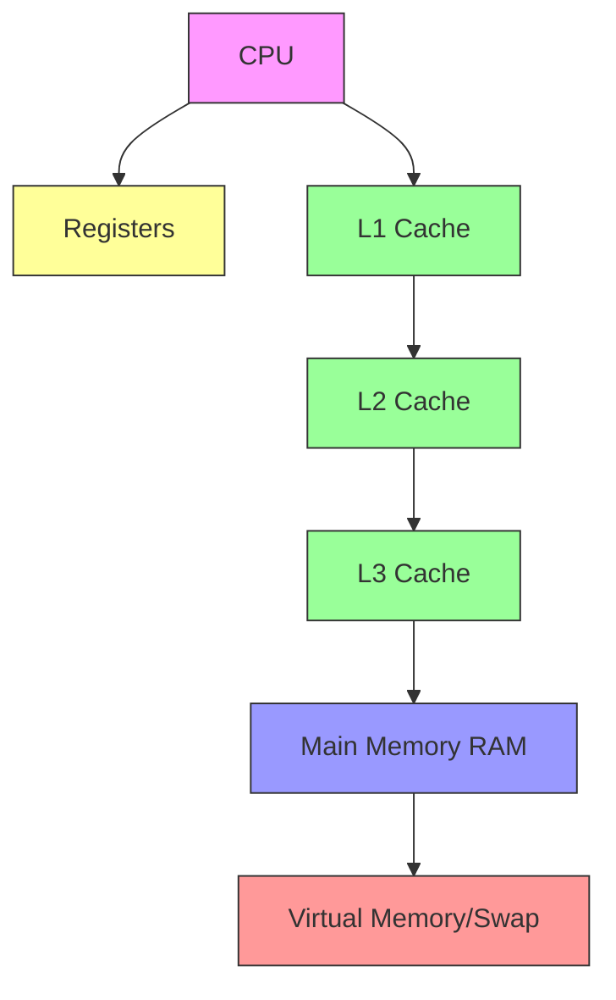
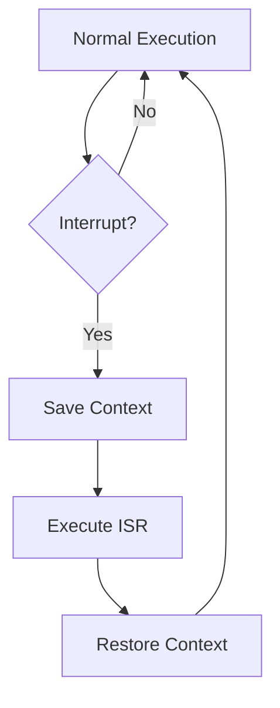
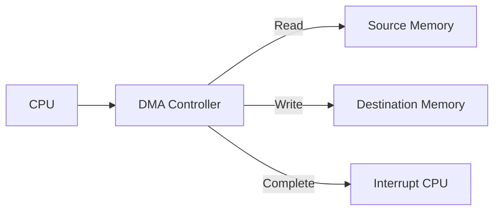
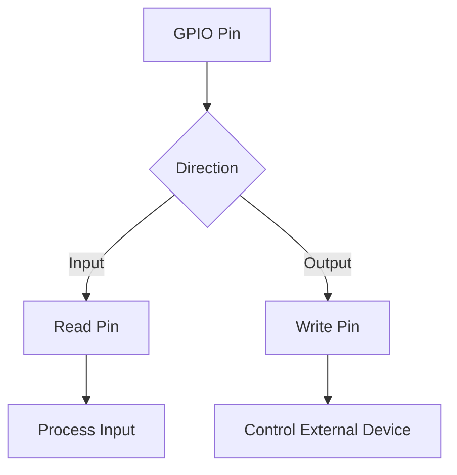
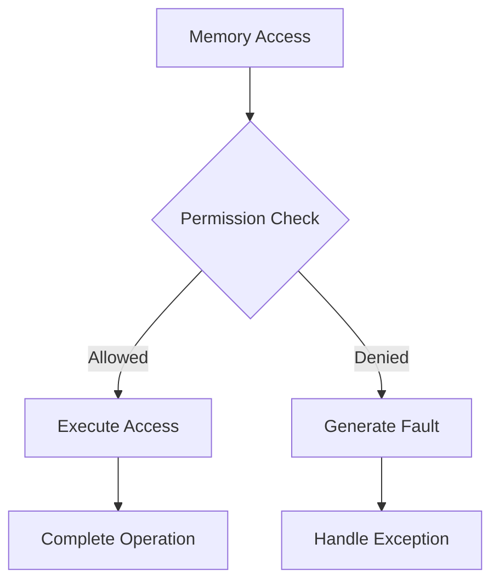

# Hardware Integration and Low-Level Programming

## Memory Hierarchy


## CPU Architecture Overview


## Memory Mapping
```c
// Memory-mapped I/O example
#define LED_REGISTER 0x20000000
#define BUTTON_REGISTER 0x20000004

volatile uint32_t* led = (uint32_t*)LED_REGISTER;
volatile uint32_t* button = (uint32_t*)BUTTON_REGISTER;

void toggle_led(void) {
    *led ^= 1;  // Toggle LED bit
}

bool is_button_pressed(void) {
    return (*button & 1) != 0;
}
```

## Interrupt Handling


```c
// Interrupt handler example
void __attribute__((interrupt)) timer_isr(void) {
    // Save context is handled by hardware/compiler
    
    // Handle interrupt
    handle_timer_event();
    
    // Clear interrupt flag
    TIMER_FLAG = 0;
    
    // Context restore is handled by hardware/compiler
}
```

## Direct Memory Access (DMA)


```c
// DMA configuration example
typedef struct {
    volatile uint32_t control;
    volatile uint32_t source;
    volatile uint32_t destination;
    volatile uint32_t length;
} DMA_Channel;

void setup_dma_transfer(void* src, void* dst, size_t len) {
    DMA_Channel* dma = (DMA_Channel*)DMA_BASE_ADDRESS;
    
    dma->source = (uint32_t)src;
    dma->destination = (uint32_t)dst;
    dma->length = len;
    dma->control = DMA_ENABLE | DMA_INTERRUPT;
}
```

## Hardware Timer Configuration
```c
// Timer setup example
typedef struct {
    volatile uint32_t control;
    volatile uint32_t value;
    volatile uint32_t compare;
} Timer;

void configure_timer(uint32_t interval_ms) {
    Timer* timer = (Timer*)TIMER_BASE_ADDRESS;
    
    // Calculate ticks from milliseconds
    uint32_t ticks = (CLOCK_FREQUENCY / 1000) * interval_ms;
    
    timer->compare = ticks;
    timer->value = 0;
    timer->control = TIMER_ENABLE | TIMER_INTERRUPT;
}
```

## GPIO Operations


```c
// GPIO manipulation example
#define GPIO_BASE 0x20200000
#define PIN_OFFSET 4

volatile uint32_t* gpio_reg = (uint32_t*)GPIO_BASE;

void set_pin_mode(int pin, int mode) {
    int reg_idx = pin / 10;
    int bit_idx = (pin % 10) * 3;
    
    uint32_t value = gpio_reg[reg_idx];
    value &= ~(7 << bit_idx);
    value |= (mode & 7) << bit_idx;
    gpio_reg[reg_idx] = value;
}
```

## Memory Protection and Security


## Hardware Debugging
1. JTAG Interface
2. In-Circuit Debugging
3. Logic Analyzers
4. Oscilloscope Usage
5. Hardware Breakpoints

## Best Practices
1. Use volatile for hardware registers
2. Implement proper error handling
3. Consider timing constraints
4. Handle race conditions
5. Protect shared resources
6. Document hardware dependencies
7. Test edge cases
8. Consider power management 