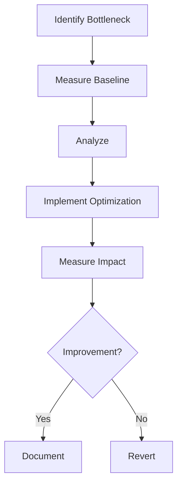

# Performance Optimization Techniques

## Optimization Process


## Optimization Techniques
```c
// Example: Loop unrolling
void process_array(int* arr, int size) {
    // Original
    for (int i = 0; i < size; i++) {
        arr[i] = arr[i] * 2;
    }
    
    // Unrolled
    int i;
    for (i = 0; i < size - 3; i += 4) {
        arr[i] = arr[i] * 2;
        arr[i+1] = arr[i+1] * 2;
        arr[i+2] = arr[i+2] * 2;
        arr[i+3] = arr[i+3] * 2;
    }
    for (; i < size; i++) {
        arr[i] = arr[i] * 2;
    }
}
```

## Best Practices
1. Measure before optimizing
2. Focus on bottlenecks
3. Use appropriate algorithms
4. Consider memory hierarchy
5. Leverage compiler optimizations
6. Profile regularly
7. Document optimizations
8. Balance readability and performance 