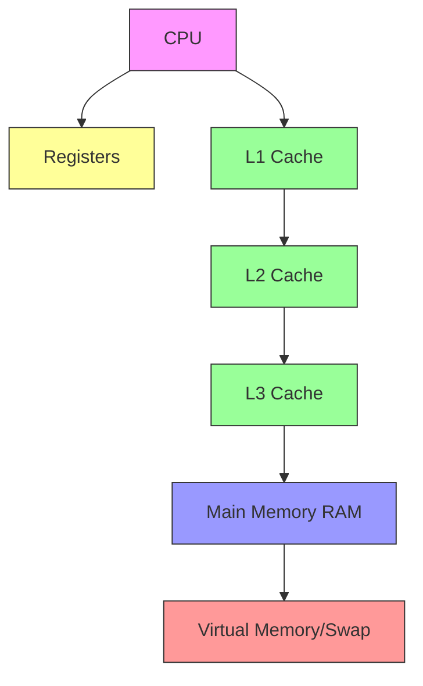

# Memory Hierarchy Diagram

## Overview

This Mermaid diagram illustrates the complex memory hierarchy in modern computer systems, showing the relationship between different levels of memory and storage.

<!-- [MermaidChart: 425bbb25-b652-4f80-aea3-fb6273eb2257] -->

## Diagram Description

## Memory Levels Explained

1. **Registers**:
   - Fastest memory
   - Directly inside the CPU
   - Extremely small storage capacity
   - Used for immediate computation

2. **L1 Cache**:
   - Very small, very fast memory
   - Typically split into instruction and data caches
   - Closest to CPU cores

3. **L2 Cache**:
   - Larger but slightly slower than L1
   - Often shared between CPU cores
   - Provides additional quick access memory

4. **L3 Cache**:
   - Largest on-chip cache
   - Shared across all CPU cores
   - Helps reduce main memory access latency

5. **Main Memory (RAM)**:
   - Large storage capacity
   - Significantly slower than cache levels
   - Holds active program data and instructions

6. **Virtual Memory/Swap**:
   - Uses disk storage as extended memory
   - Allows programs to use more memory than physical RAM
   - Slowest memory access method

## Performance Implications

- Each level represents a trade-off between speed and capacity
- Closer to the CPU means faster access but smaller size
- Memory hierarchy design is crucial for system performance

## Key Concepts

- Locality of Reference
- Cache Coherence
- Memory Bandwidth
- Latency vs Throughput
