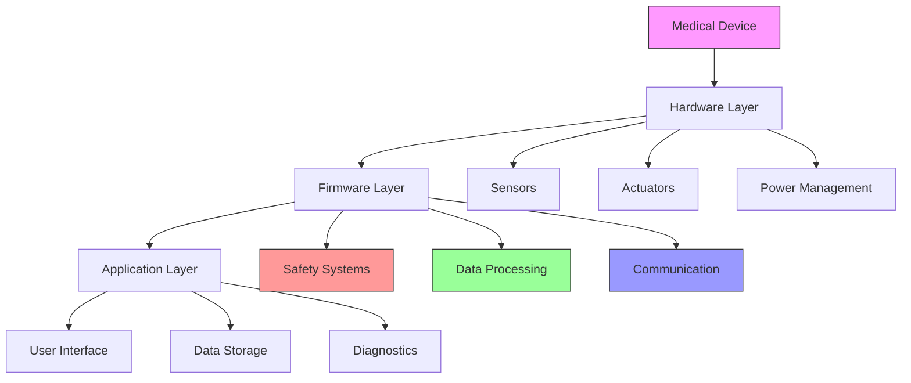

# Medical Device System Architecture Diagram

## Overview

This Mermaid diagram provides a comprehensive visualization of a medical device's architectural layers, highlighting the complex interactions between hardware, firmware, and application components.

<!-- [MermaidChart: 14305222-22be-48f9-8445-8f96e530278e] -->

## Diagram Description

## Architectural Layers Explained

### 1. Hardware Layer

- **Sensors**: Collect physiological or environmental data
- **Actuators**: Enable device interactions or interventions
- **Power Management**: Control energy consumption and battery life

### 2. Firmware Layer

- **Safety Systems**: Implement critical safety checks and fail-safes
- **Data Processing**: Transform raw sensor data into meaningful information
- **Communication**: Manage data transmission protocols

### 3. Application Layer

- **User Interface**: Provide interaction mechanisms
- **Data Storage**: Manage historical and real-time data
- **Diagnostics**: Enable self-monitoring and reporting

## Design Principles

- Modularity
- Redundancy
- Low-power design
- Real-time responsiveness
- Strict safety compliance

## Interdisciplinary Considerations

- Electronics engineering
- Software development
- Medical regulations
- Human-computer interaction
- Biomedical signal processing

## Key Performance Metrics

- Reliability
- Power efficiency
- Data accuracy
- Response time
- User experience
