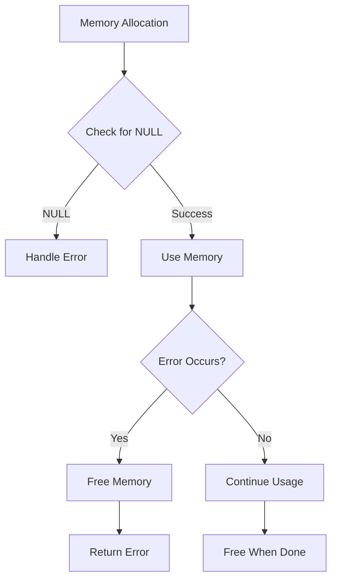
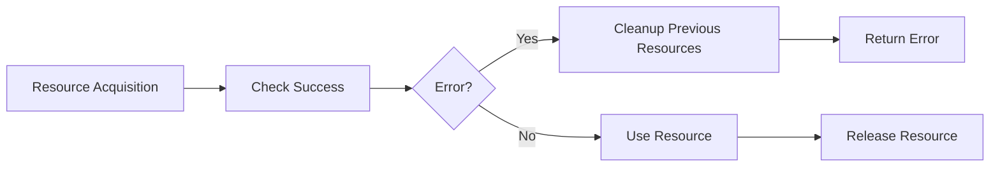
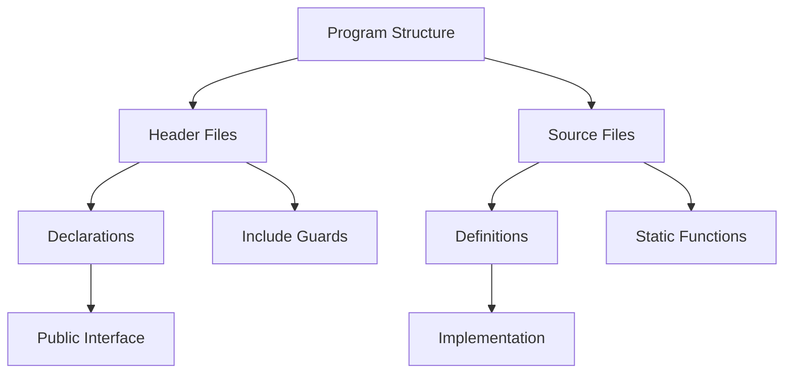

# Common C Programming Gotchas and Best Practices


## Memory Management Issues

### Memory Leaks
```c
// WRONG: Memory leak
char* get_string() {
    char* str = malloc(10);
    return str;  // Caller must remember to free
}

// BETTER: Document memory ownership
/* Caller is responsible for freeing returned string */
char* get_string() {
    char* str = malloc(10);
    if (!str) return NULL;
    return str;
}
```

### Buffer Overflows
```c
// WRONG: Potential buffer overflow
char buffer[5];
strcpy(buffer, "Hello, World!");  // Writes beyond buffer

// BETTER: Use strncpy or check sizes
char buffer[5];
strncpy(buffer, "Hello, World!", sizeof(buffer) - 1);
buffer[sizeof(buffer) - 1] = '\0';  // Ensure null termination
```

### Pointer Arithmetic
```c
// WRONG: Undefined behavior
int arr[5] = {1, 2, 3, 4, 5};
int* ptr = arr + 5;  // Points one past array
printf("%d", *ptr);  // Undefined behavior!

// BETTER: Stay within bounds
int arr[5] = {1, 2, 3, 4, 5};
for (int* ptr = arr; ptr < arr + 5; ptr++) {
    printf("%d ", *ptr);
}
```

## Best Practices

### 1. Memory Management


### 2. Resource Management


### 3. Error Handling
- Always check return values
- Clean up resources on error paths
- Use errno and perror for system calls
- Document error conditions and handling

### 4. Code Organization


## Common Pitfalls Checklist
1. [ ] Uninitialized variables
2. [ ] Missing NULL checks
3. [ ] Buffer overflows
4. [ ] Memory leaks
5. [ ] Dangling pointers
6. [ ] Integer overflow
7. [ ] Sign extension issues
8. [ ] Platform dependencies

## Debugging Tips
- Use Valgrind for memory issues
- Enable compiler warnings (-Wall -Wextra)
- Use debugger (GDB/LLDB)
- Add logging/assertions
- Check error conditions

## Platform Considerations
- Endianness
- Word size
- Alignment requirements
- Compiler differences
- OS-specific behavior 