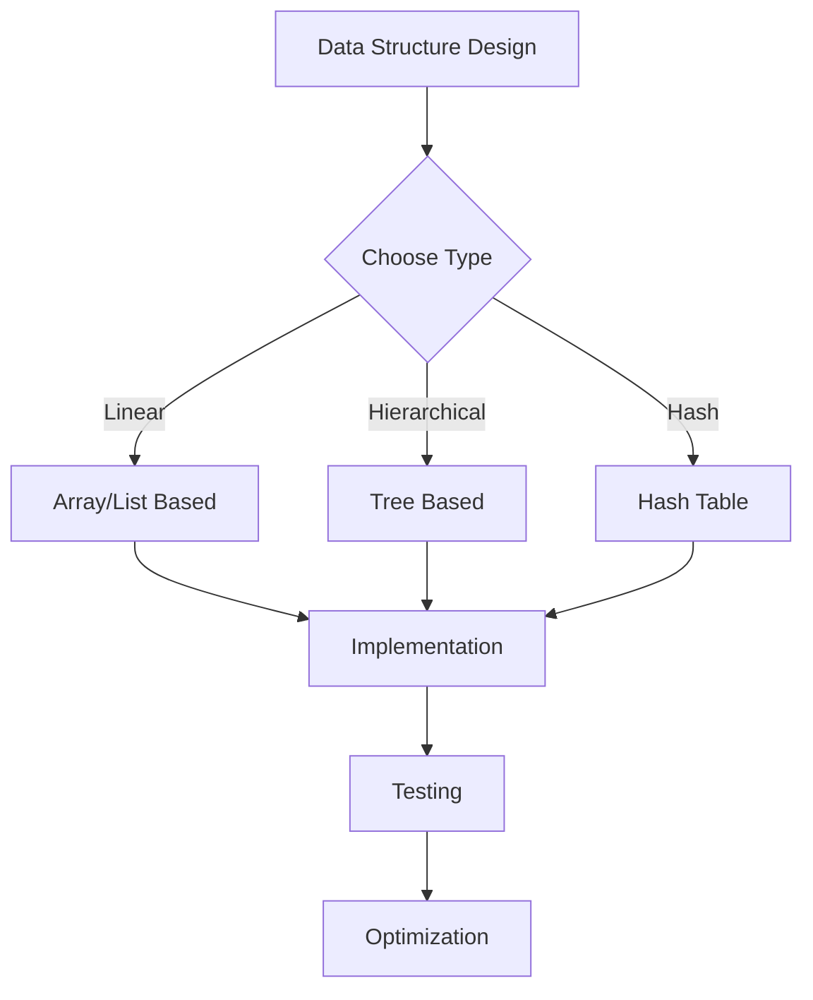
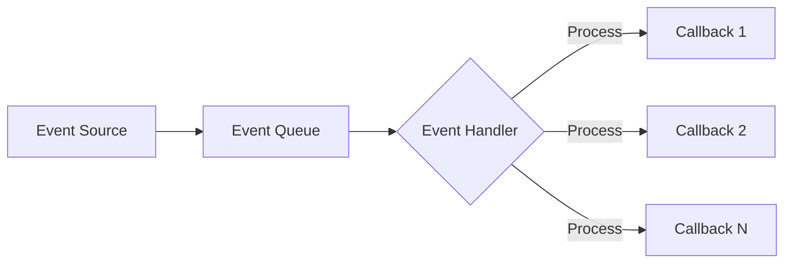
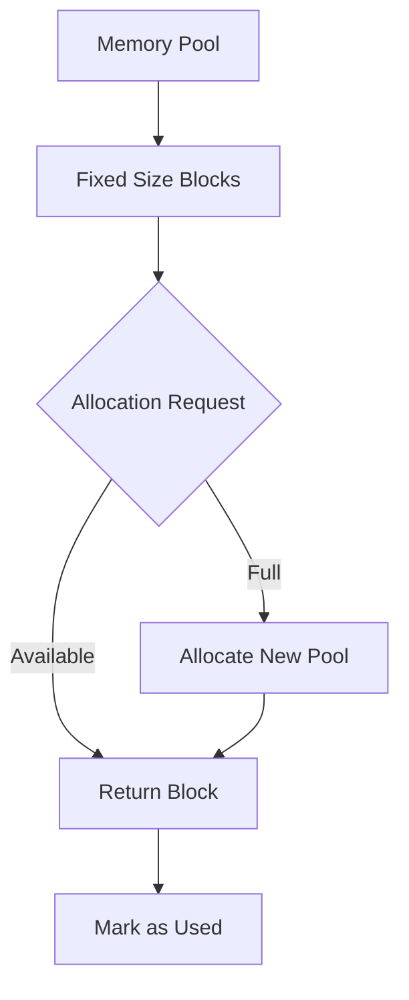
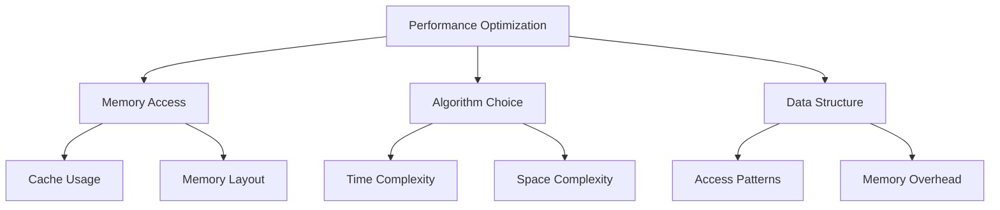

# Practical C Programming Examples and Data Structures

## Data Structure Implementation Flow



## Dynamic Array Implementation

```c
typedef struct {
    int* data;
    size_t size;
    size_t capacity;
} DynamicArray;

DynamicArray* create_array(size_t initial_capacity) {
    DynamicArray* arr = malloc(sizeof(DynamicArray));
    if (!arr) return NULL;

    arr->data = malloc(initial_capacity * sizeof(int));
    if (!arr->data) {
        free(arr);
        return NULL;
    }

    arr->size = 0;
    arr->capacity = initial_capacity;
    return arr;
}

void destroy_array(DynamicArray* arr) {
    if (arr) {
        free(arr->data);
        free(arr);
    }
}

bool array_push(DynamicArray* arr, int value) {
    if (arr->size == arr->capacity) {
        size_t new_capacity = arr->capacity * 2;
        int* new_data = realloc(arr->data, new_capacity * sizeof(int));
        if (!new_data) return false;

        arr->data = new_data;
        arr->capacity = new_capacity;
    }

    arr->data[arr->size++] = value;
    return true;
}
```

## Binary Search Tree Implementation

```c
typedef struct Node {
    int data;
    struct Node* left;
    struct Node* right;
} Node;

Node* create_node(int value) {
    Node* node = malloc(sizeof(Node));
    if (node) {
        node->data = value;
        node->left = NULL;
        node->right = NULL;
    }
    return node;
}

Node* insert(Node* root, int value) {
    if (!root) return create_node(value);

    if (value < root->data)
        root->left = insert(root->left, value);
    else if (value > root->data)
        root->right = insert(root->right, value);

    return root;
}

void destroy_tree(Node* root) {
    if (root) {
        destroy_tree(root->left);
        destroy_tree(root->right);
        free(root);
    }
}
```

## Event System Implementation



```c
typedef void (*EventHandler)(const char* event);

typedef struct {
    EventHandler* handlers;
    size_t count;
    size_t capacity;
} EventSystem;

EventSystem* create_event_system(size_t initial_capacity) {
    EventSystem* sys = malloc(sizeof(EventSystem));
    if (!sys) return NULL;

    sys->handlers = malloc(initial_capacity * sizeof(EventHandler));
    if (!sys->handlers) {
        free(sys);
        return NULL;
    }

    sys->count = 0;
    sys->capacity = initial_capacity;
    return sys;
}

bool register_handler(EventSystem* sys, EventHandler handler) {
    if (sys->count == sys->capacity) {
        size_t new_capacity = sys->capacity * 2;
        EventHandler* new_handlers = realloc(sys->handlers,
                                           new_capacity * sizeof(EventHandler));
        if (!new_handlers) return false;

        sys->handlers = new_handlers;
        sys->capacity = new_capacity;
    }

    sys->handlers[sys->count++] = handler;
    return true;
}
```

## Memory Pool Implementation



```c
typedef struct Block {
    struct Block* next;
    bool is_free;
    char data[];  // Flexible array member
} Block;

typedef struct {
    Block* first_block;
    size_t block_size;
    size_t pool_size;
} MemoryPool;

MemoryPool* create_pool(size_t block_size, size_t initial_blocks) {
    MemoryPool* pool = malloc(sizeof(MemoryPool));
    if (!pool) return NULL;

    size_t total_block_size = sizeof(Block) + block_size;
    pool->first_block = malloc(total_block_size * initial_blocks);
    if (!pool->first_block) {
        free(pool);
        return NULL;
    }

    // Initialize blocks
    Block* current = pool->first_block;
    for (size_t i = 0; i < initial_blocks - 1; i++) {
        current->is_free = true;
        current->next = (Block*)((char*)current + total_block_size);
        current = current->next;
    }
    current->is_free = true;
    current->next = NULL;

    pool->block_size = block_size;
    pool->pool_size = initial_blocks;
    return pool;
}
```

## Practice Projects

1. Implement a Thread-Safe Queue
2. Create a Simple Memory Allocator
3. Build a File System Cache
4. Develop a Network Protocol Parser
5. Design a Task Scheduler

## Performance Considerations



## Testing Strategies

1. Unit Testing
2. Memory Testing
3. Performance Testing
4. Edge Case Testing
5. Integration Testing
