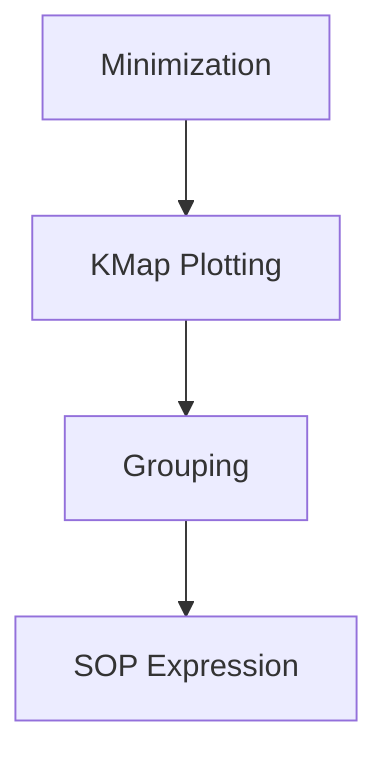

# Homework Week Two Assignment One

## Table of Contents

- [Homework Week Two Assignment One](#homework-week-two-assignment-one)
  - [Table of Contents](#table-of-contents)
  - [1. 2's Complement Conversions](#1-2s-complement-conversions)
  - [2. SOP and KMap Derivations](#2-sop-and-kmap-derivations)
  - [3. Don't Care Handling](#3-dont-care-handling)
  - [Quick Reference Cheat Sheet](#quick-reference-cheat-sheet)
  - [Conceptual Map](#conceptual-map)

## 1. 2's Complement Conversions

Explanation: Provide a brief overview of two's complement arithmetic.
Definitions:
• Two's Complement: A method for representing negative numbers in binary.
• Bit Width: The number of bits used for representation.
Annotated Example:
• Example: Convert the binary number 101 (3-bit) to its 2's complement.
• Step 1: Identify the sign bit.
• Step 2: Invert the bits (for negative numbers) and add 1.
• Partial Solution: For binary 101 -> Inversion gives 010; adding 1 yields 011.
Visual Aid: 

## 2. SOP and KMap Derivations

Explanation: Summarize the concept of SOP expressions and KMap derivations.
Step-by-step Instructions:

1. List all minterms.
2. Plot minterms on a KMap.
3. Group adjacent 1's to form prime implicants.
4. Derive the SOP expression.
Annotated Truth Table:
| A   | B   | C   | Output |
| --- | --- | --- | ------ |
| 0   | 0   | 0   | X      |
| 0   | 0   | 1   | 1      |
| 0   | 1   | 0   | 0      |
| 0   | 1   | 1   | 1      |
| 1   | 0   | 0   | X      |
| 1   | 0   | 1   | 1      |
| 1   | 1   | 0   | 0      |
| 1   | 1   | 1   | 1      |
Visual Aid:

## 3. Don't Care Handling

Explanation: Describe when and why to use don't care conditions in KMaps.
Instructions:

- Mark ambiguous or irrelevant inputs with an 'X'.
- During grouping, treat 'X' as 0 to simplify the expression.
Visual Aid: 

## Quick Reference Cheat Sheet

• 2's Complement Formula: For an n-bit number, represents values from -(2^(n-1)) to (2^(n-1))-1.
• Boolean Simplification Rules:
  A + A' = 1
  A · A' = 0
• Additional Resources:
  [Binary Arithmetic Reference](../../link/to/binary_arithmetic)
  [Boolean Algebra Rules](../../link/to/boolean_algebra)

## Conceptual Map

• Overview: This assignment covers fundamentals of two's complement conversion, SOP derivations, and don't care handling.
• Key Topics:

- Two's Complement Conversions
- SOP and KMap Derivations
- Don't Care Handling
