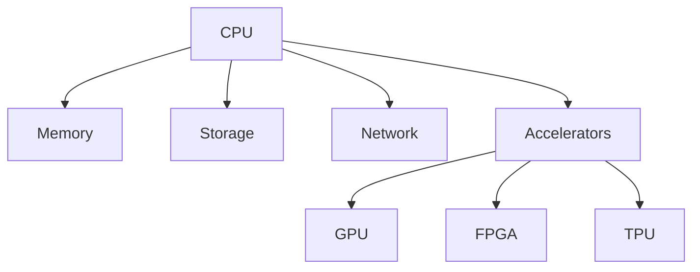

# Modern Hardware Integration

## Hardware Architecture


## Hardware Interaction
```c
// Example: Memory-mapped I/O
#define DEVICE_ADDRESS 0x1000
volatile unsigned int* device_reg = (unsigned int*)DEVICE_ADDRESS;

void write_to_device(unsigned int value) {
    *device_reg = value;
}

unsigned int read_from_device() {
    return *device_reg;
}
```

## Best Practices
1. Understand hardware architecture
2. Use appropriate abstraction layers
3. Optimize for hardware capabilities
4. Handle hardware-specific features
5. Implement proper error handling
6. Consider power management
7. Use hardware security features
8. Stay updated with hardware trends 