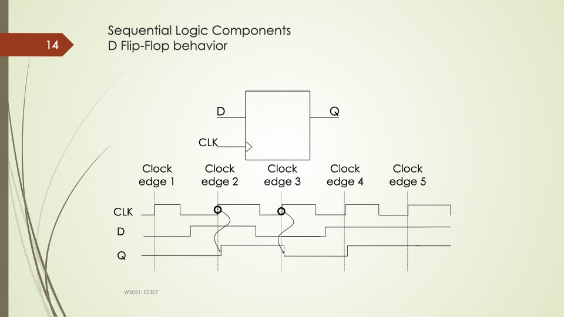
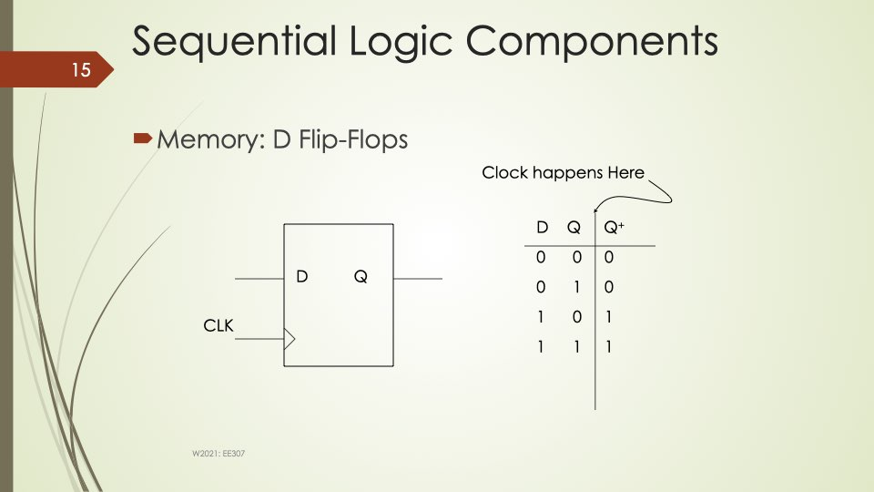

### Initial Assessment

The image illustrates the behavior of a
, a fundamental sequential logic component. It shows how the output \( Q \) responds to the input \( D \) on the rising edge of the clock signal \( CLK \).

### Contextual Insights

- **D Flip-Flop**: A type of flip-flop that captures the value of the input \( D \) at a specific clock edge and holds it until the next clock edge.
- **Clock Edge**: The transition point of the clock signal, typically the rising edge, where the flip-flop samples the input.

### Component Breakdown

- **CLK (Clock)**: The timing signal that synchronizes the flip-flop's operations.
- **D (Data Input)**: The input signal whose value is captured by the flip-flop.
- **Q (Output)**: The output signal that reflects the captured value of \( D \).

### Reasoning and Analysis

- At each rising clock edge, the flip-flop checks the value of \( D \) and updates \( Q \) accordingly.
- The output \( Q \) remains constant between clock edges, reflecting the value of \( D \) at the last clock edge.

### Output Generation Guidance

- **Notation Key**: Define symbols like \( D \), \( Q \), and \( CLK \).
- **Truth Table**: Not applicable as this is a sequential device.
- **Gate Operations**: Not directly visible but involves internal logic gates to maintain state.

### Examples

- **Clock Edge 1**: \( Q \) captures the initial value of \( D \).
- **Clock Edge 2-5**: \( Q \) updates based on the value of \( D \) at each clock edge.

### Notes and Clarifications

- The D Flip-Flop is edge-triggered, meaning it only responds to changes at the clock edge.
- This behavior is crucial for designing synchronous circuits where timing is essential.

### Initial Assessment
The image illustrates the behavior of a D Flip-Flop, a fundamental sequential logic component. It shows how the output \( Q \) changes in response to the clock signal \( CLK \) and the data input \( D \).

### Contextual Insights
- **D Flip-Flop**: Captures the value of the data input \( D \) at a specific clock edge and holds it until the next clock edge.
- **Clock Edges**: The image highlights five clock edges, showing how the output \( Q \) responds to changes in \( D \) at each edge.

### Component Breakdown
- **Clock (CLK)**: Synchronizes the changes in the flip-flop.
- **Data Input (D)**: The value to be stored in the flip-flop.
- **Output (Q)**: Reflects the stored value after the clock edge.

### Reasoning and Analysis
- **Clock Edge 1**: \( Q \) captures the value of \( D \).
- **Clock Edge 2-5**: \( Q \) updates based on the value of \( D \) at each rising clock edge.

### Output Generation Guidance
- **Notation Key**: Define symbols like \( D \), \( Q \), and \( CLK \).
- **Possible Inputs**: \( D \) can be 0 or 1.
- **Truth Table**: Not applicable as this is sequential logic.
- **Gate Operations**: Not directly shown, but involves a latch mechanism.
- **Circuit Diagram Representation**: Already provided in the image.
- **Full Signal Analysis**: Analyze how \( Q \) changes with each clock edge.

### Examples
- **Clock Edge 1**: If \( D = 1 \), then \( Q \) becomes 1.
- **Clock Edge 3**: If \( D = 0 \), then \( Q \) becomes 0.

### Notes and Clarifications
- **Edge-Triggered**: The D Flip-Flop is typically edge-triggered, meaning it responds to changes at the clock edge.
- **Sequential Logic**: Unlike combinational logic, the output depends on the sequence of inputs.

This structured approach helps in understanding the behavior and application of D Flip-Flops in digital circuits.
### Initial Assessment

The image illustrates a **D Flip-Flop**, a fundamental component in sequential logic circuits. It shows the relationship between the data input (D), the clock signal (CLK), and the output (Q).

### Contextual Insights

- **D Flip-Flop**: A memory element that captures the value of the D input at a specific clock edge and holds it until the next clock event.
- **Clock Signal**: Triggers the flip-flop to store the input value.

### Component Breakdown

- **Inputs**: D (Data), CLK (Clock)
- **Output**: Q (Output)

### Reasoning and Analysis

- **Operation**: On the clock edge, the D input is transferred to the Q output.
- **Truth Table**:
  - When D = 0 and CLK triggers, Q becomes 0.
  - When D = 1 and CLK triggers, Q becomes 1.

### Output Generation Guidance

- **Notation Key**: D (Data), Q (Output), CLK (Clock)
- **Truth Table**: As shown in the image, detailing the state transitions.

### Examples

- **Example**: If D = 1 and the clock edge occurs, Q will be set to 1.

### Notes and Clarifications

- **Edge-Triggered**: The flip-flop changes state on a specific clock edge (rising or falling).

This breakdown provides a structured understanding of the D Flip-Flop's function and operation within sequential logic circuits.
