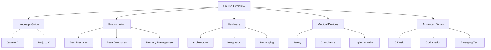

# Course Structure Diagram

## Overview

This Mermaid diagram visualizes the comprehensive structure of the CIS 240 course, showing the interconnected learning paths and key focus areas.

<!-- [MermaidChart: d428ef2a-84b6-4c41-bb3f-ec28f3d9a113] -->

## Diagram Description

## Key Components

- **Course Overview**: Central node representing the foundational starting point
- **Language Guide**: Transition paths from Java and Mojo to C
- **Programming**: Core programming concepts and best practices
- **Hardware**: Low-level hardware understanding and integration
- **Medical Devices**: Specialized domain focusing on safety and implementation
- **Advanced Topics**: Cutting-edge technologies and optimization techniques

## Learning Paths

- **Beginner Path**: Follows a linear progression through foundational topics
- **Advanced Path**: Explores specialized domains and advanced concepts

## Interdisciplinary Connections

The diagram highlights the interconnected nature of computer architecture, showing how different domains relate and build upon each other.
