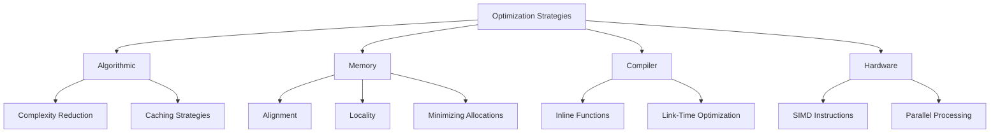

# Performance Optimization Strategies Diagram

## Overview

This Mermaid diagram illustrates the multifaceted approach to performance optimization in software and hardware systems, showcasing various strategies across different domains.

<!-- [MermaidChart: 4e8cea33-1f01-4855-95af-71a5ddd06bb1] -->

## Diagram Description

## Optimization Domains

### 1. Algorithmic Optimization

- **Complexity Reduction**
  - Big O notation analysis
  - Efficient data structures
  - Algorithmic design patterns

- **Caching Strategies**
  - Memoization
  - Result caching
  - Predictive prefetching

### 2. Memory Optimization

- **Alignment**
  - Memory boundary optimization
  - Struct packing
  - Cache line utilization

- **Locality**
  - Spatial locality
  - Temporal locality
  - Data structure design

- **Minimizing Allocations**
  - Memory pool techniques
  - Object reuse
  - Reduced dynamic allocation

### 3. Compiler Optimization

- **Inline Functions**
  - Reducing function call overhead
  - Context-aware inlining
  - Compile-time function expansion

- **Link-Time Optimization**
  - Whole program optimization
  - Dead code elimination
  - Global optimization techniques

### 4. Hardware Optimization

- **SIMD Instructions**
  - Vectorization
  - Parallel data processing
  - Single instruction, multiple data

- **Parallel Processing**
  - Multi-core utilization
  - Concurrent algorithms
  - Load balancing

## Interdisciplinary Approach

- Software engineering
- Computer architecture
- Compiler design
- Low-level system programming

## Key Performance Metrics

- Execution time
- Memory usage
- CPU utilization
- Energy efficiency
- Scalability

## Best Practices

- Measure before optimizing
- Use profiling tools
- Understand system bottlenecks
- Balance readability and performance
- Consider domain-specific constraints
