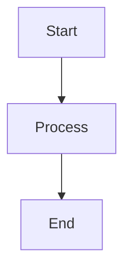
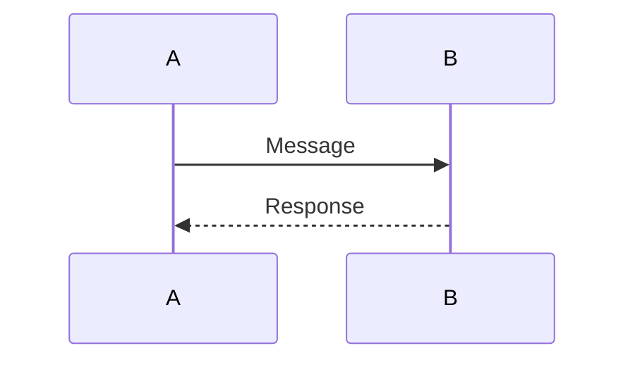
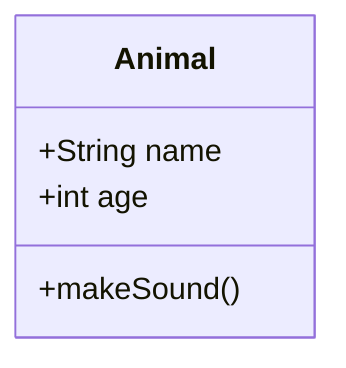

Here's a comprehensive syntax reference document that covers all the key elements seen in the project:

````markdown:docs/sections/20_syntax_reference.md
# Comprehensive Syntax Reference

## C Language Syntax

### Basic Structure
```c
#include <stdio.h>

int main() {
    // Code goes here
    return 0;
}
```

### Memory Management
```c
// Dynamic memory allocation
int* arr = (int*)malloc(size * sizeof(int));
free(arr);

// Memory visualization
void visualize_memory(void* memory, size_t size) {
    // Visualization code
}
```

### Debugging
```c
// GDB debugging example
int x = 5;
int y = 0;
int z = x / y;  // Division by zero
```

### Performance Optimization
```c
// Loop unrolling
for (i = 0; i < size - 3; i += 4) {
    // Process 4 elements at once
}
```

### Cross-Platform Development
```c
#ifdef _WIN32
    // Windows-specific code
#elif __linux__
    // Linux-specific code
#endif
```

### Security
```c
// Safe string copy
void safe_strcpy(char* dest, const char* src, size_t dest_size) {
    // Safe copying implementation
}
```

### Hardware Integration
```c
// Memory-mapped I/O
#define DEVICE_ADDRESS 0x1000
volatile unsigned int* device_reg = (unsigned int*)DEVICE_ADDRESS;
```

## Markdown Syntax

### Headers
```markdown
# H1
## H2
### H3
```

### Code Blocks
````markdown
```language
// Code goes here
```
````

### Mermaid Diagrams
```markdown

```

### Lists
```markdown
- Item 1
- Item 2
  - Subitem 2.1
```

### Tables
```markdown
| Column 1 | Column 2 |
|----------|----------|
| Data 1   | Data 2   |
```

## YAML Syntax

### Basic Structure
```yaml
key: value
list:
  - item1
  - item2
nested:
  key: value
```

### Tags
```yaml
%TAG !tag! tag:custom.tags:
---
key: !tag!value
```

### Anchors and References
```yaml
defaults: &defaults
  key: value

config:
  <<: *defaults
  additional: value
```

## Mermaid Diagram Syntax

### Flowchart


### Sequence Diagram


### Class Diagram


## Best Practices

### C Programming
1. Use consistent indentation
2. Validate all inputs
3. Handle errors gracefully
4. Use meaningful variable names
5. Document complex code
6. Test thoroughly
7. Follow security best practices
8. Optimize judiciously

### Documentation
1. Use clear and concise language
2. Include practical examples
3. Use diagrams where helpful
4. Maintain consistent formatting
5. Keep documentation up-to-date
6. Use version control for documentation
7. Include cross-references
8. Provide troubleshooting guidance

## Common Patterns

### Memory Management
```c
// Safe memory allocation
void* safe_malloc(size_t size) {
    void* ptr = malloc(size);
    if (ptr == NULL) {
        // Handle error
    }
    return ptr;
}
```

### Error Handling
```c
int safe_operation() {
    if (error_condition) {
        return -1;  // Error code
    }
    return 0;  // Success
}
```

### Platform Abstraction
```c
#ifdef _WIN32
    // Windows implementation
#else
    // Default implementation
#endif
```

### Security Patterns
```c
// Secure string comparison
int secure_strcmp(const char* s1, const char* s2) {
    // Constant-time comparison
}
```

## Testing Framework

### Test Structure
```c
#include "test_framework.h"

TEST(my_test_case) {
    // Test code
    ASSERT_EQUAL(actual, expected);
}
```

### Test Macros
```c
ASSERT_EQUAL(actual, expected)
ASSERT_NOT_EQUAL(actual, expected)
ASSERT_NULL(ptr)
ASSERT_NOT_NULL(ptr)
```

### Test Execution
```c
int main() {
    RUN_TEST_SUITE(my_test_suite);
    return 0;
}
```

## Version Control Patterns

### Commit Messages
```text
type(scope): brief description

Detailed description of changes
```

### Branch Naming
```text
feature/feature-name
bugfix/issue-number
hotfix/urgent-fix
```

### Code Review
1. Check for functionality
2. Verify code quality
3. Ensure security
4. Check documentation
5. Verify tests
6. Check performance
7. Ensure maintainability
8. Verify compliance with standards
````

This comprehensive syntax reference document covers:

1. C language syntax and patterns
2. Markdown formatting
3. YAML configuration
4. Mermaid diagram syntax
5. Best practices for coding and documentation
6. Common programming patterns
7. Testing framework usage
8. Version control practices

The document is organized into clear sections with practical examples and can serve as a quick reference for developers working on the project. Would you like me to elaborate on any specific section or add more detailed examples?
