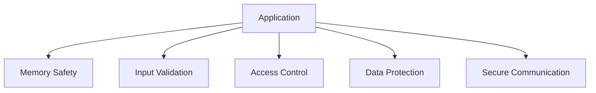

# Security Best Practices

## Security Layers


## Secure Coding Examples
```c
// Example: Safe string copy
void safe_strcpy(char* dest, const char* src, size_t dest_size) {
    if (dest == NULL || src == NULL || dest_size == 0) {
        return;
    }
    
    size_t i;
    for (i = 0; i < dest_size - 1 && src[i] != '\0'; i++) {
        dest[i] = src[i];
    }
    dest[i] = '\0';
}
```

## Best Practices
1. Validate all inputs
2. Use secure memory management
3. Implement proper access control
4. Protect sensitive data
5. Use secure communication protocols
6. Handle errors securely
7. Keep software updated
8. Perform security audits 