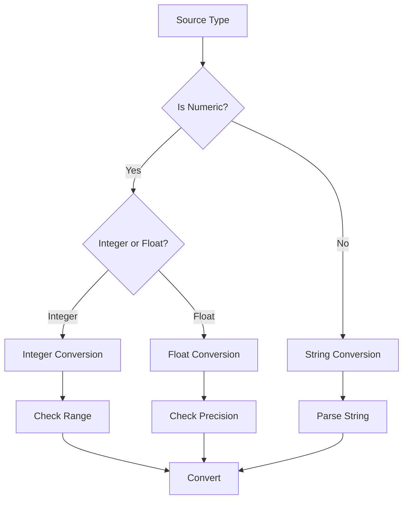
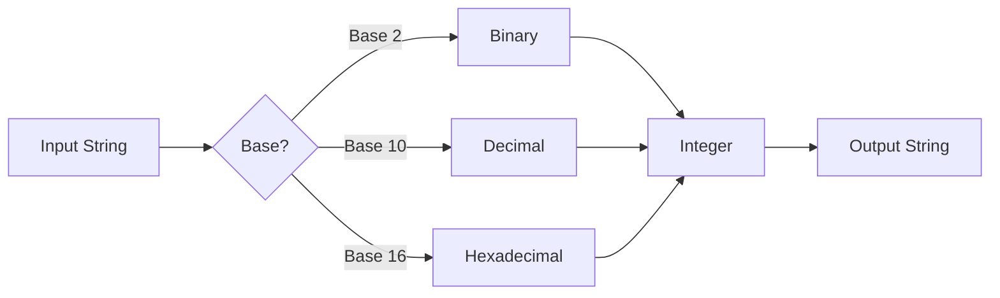
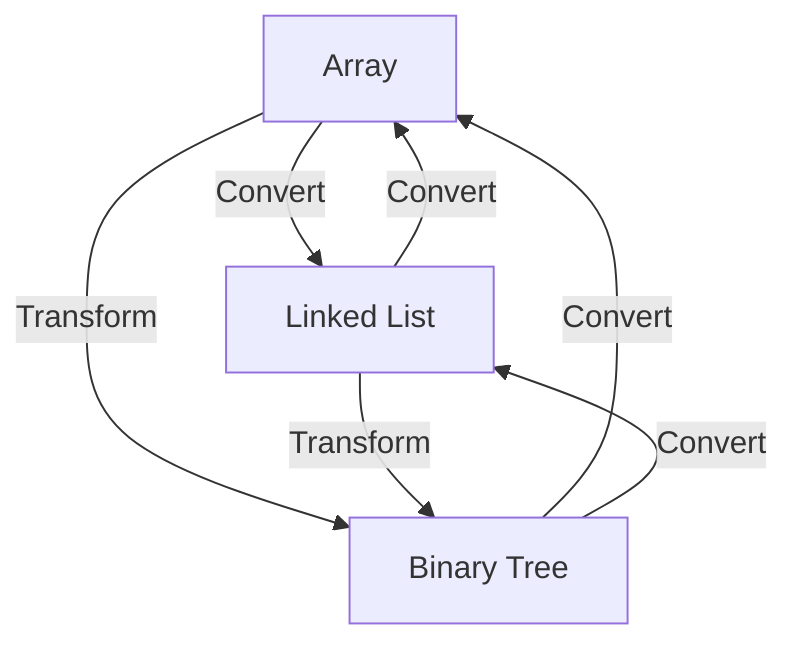
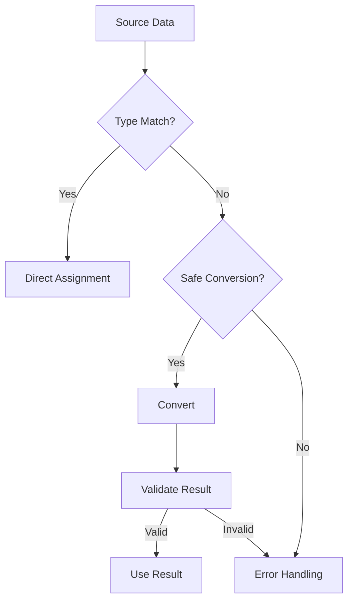

# Data Type Conversions and Transformations

## Type Conversion Flowchart


## String and Number Conversions
```c
// String to Integer conversion
char str[] = "12345";
int num = atoi(str);              // Basic conversion
long lnum = strtol(str, NULL, 10); // More control, base 10

// Integer to String conversion
int num = 12345;
char str[20];
sprintf(str, "%d", num);          // Using sprintf
// or
snprintf(str, sizeof(str), "%d", num);  // Safer, prevents buffer overflow

// Floating point conversions
char float_str[] = "123.45";
float f = atof(float_str);        // String to float
double d = strtod(float_str, NULL); // String to double
```

## Base Conversions


```c
// Hexadecimal string to integer
char hex[] = "1A";
int hex_val = (int)strtol(hex, NULL, 16);  // Base 16

// Binary string to integer
char bin[] = "1010";
int bin_val = (int)strtol(bin, NULL, 2);   // Base 2

// Integer to hex string
int val = 26;
char hex_str[10];
sprintf(hex_str, "%X", val);  // Uppercase hex
sprintf(hex_str, "%x", val);  // Lowercase hex

// Working with different bases
printf("Decimal: %d\n", val);     // Base 10
printf("Hex: 0x%X\n", val);       // Base 16
printf("Octal: %o\n", val);       // Base 8
```

## Data Structure Transformations


## Type Safety Guidelines
1. Always check conversion results
2. Use appropriate buffer sizes
3. Handle overflow conditions
4. Consider platform differences
5. Document assumptions
6. Use safe conversion functions
7. Validate input data
8. Test edge cases

## Common Conversion Patterns


## Error Handling in Conversions
- Check errno after conversions
- Validate range constraints
- Handle special cases
- Provide error feedback
- Clean up on failure
- Document error conditions 