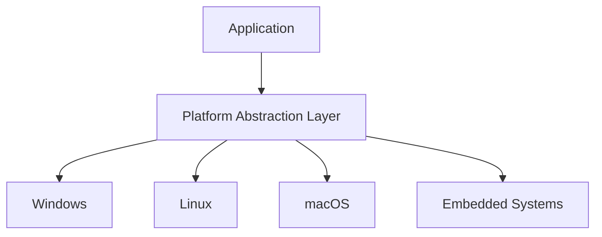

# Cross-Platform Development Strategies

## Platform Abstraction


## Cross-Platform Techniques
```c
// Example: Platform-specific code
#ifdef _WIN32
    #include <windows.h>
#elif __linux__
    #include <unistd.h>
#endif

void sleep_ms(int milliseconds) {
    #ifdef _WIN32
        Sleep(milliseconds);
    #elif __linux__
        usleep(milliseconds * 1000);
    #endif
}
```

## Best Practices
1. Use platform abstraction layers
2. Write portable code
3. Test on all target platforms
4. Use conditional compilation
5. Handle endianness
6. Consider word size differences
7. Use cross-platform libraries
8. Document platform-specific behavior