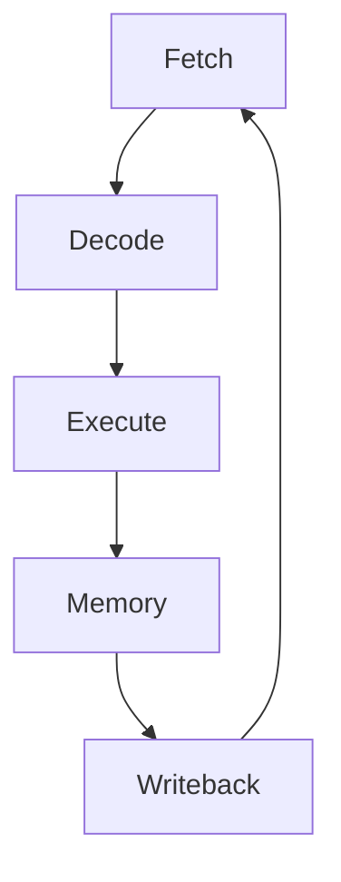

# Advanced Visualization Techniques

## Memory Visualization
```c
// Memory block visualization
void visualize_memory(void* memory, size_t size) {
    printf("\nMemory Layout:\n");
    printf("+");
    for (int i = 0; i < size/BLOCK_SIZE; i++) {
        printf("--------+");
    }
    printf("\n|");
    
    for (int i = 0; i < size; i++) {
        if (((char*)memory)[i] == 0) {
            printf(" FREE  |");
        } else {
            printf(" ALLOC |");
        }
        if ((i+1) % BLOCK_SIZE == 0 && i != size-1) {
            printf("\n+");
            for (int j = 0; j < size/BLOCK_SIZE; j++) {
                printf("--------+");
            }
            printf("\n|");
        }
    }
    
    printf("\n+");
    for (int i = 0; i < size/BLOCK_SIZE; i++) {
        printf("--------+");
    }
    printf("\n");
}
```

## Pipeline Visualization


## Cache Visualization
```c
// Cache line visualization
void visualize_cache(struct CacheLine* cache) {
    printf("\nCache Visualization:\n");
    printf("+--------+-----+---------------------+\n");
    printf("| Index  | Tag | Data                |\n");
    printf("+--------+-----+---------------------+\n");
    
    for (int i = 0; i < CACHE_SIZE; i++) {
        printf("| %6d | %3d |", i, cache[i].tag);
        if (cache[i].valid) {
            for (int j = 0; j < BLOCK_SIZE; j++) {
                printf(" %4d", cache[i].data[j]);
            }
        } else {
            printf("     Empty     ");
        }
        printf(" |\n");
    }
    printf("+--------+-----+---------------------+\n");
}
```

## Best Practices
1. Use consistent visualization styles
2. Include clear legends and labels
3. Use color coding effectively
4. Maintain proper scaling
5. Ensure accessibility
6. Use interactive visualizations when possible
7. Document visualization assumptions
8. Validate visualization accuracy